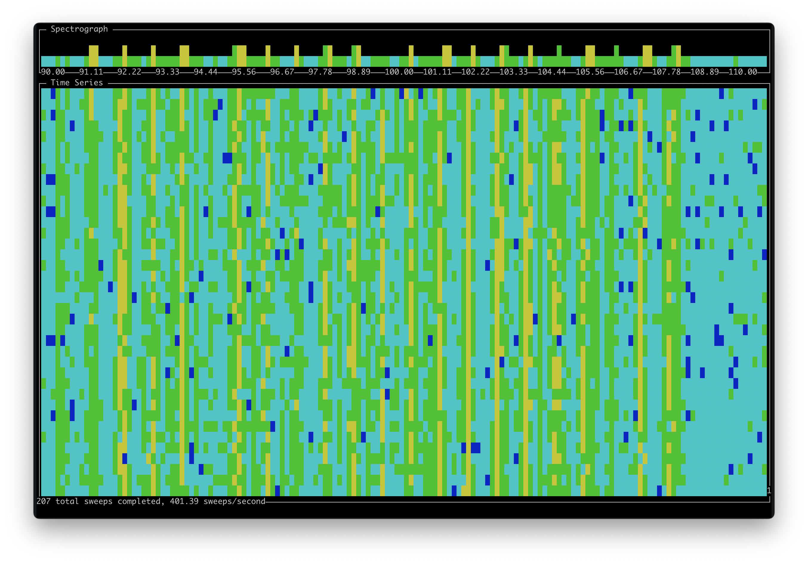

# CLI hackrf_sweep Spectrum Analyzer

This is a real-time command line interface (CLI) spectrum analyzer for displaying the output of [hackrf_sweep](https://hackrf.readthedocs.io/en/latest/hackrf_tools.html#hackrf-sweep).

## Features

- Real-time spectrograph and waterfall display
- Interactive keyboard controls (pause, peak hold, sensitivity adjustment)
- Mouse support
- Configurable power range and display settings
- Terminal resize handling
- Sub-pixel rendering for smooth visualization

## Installation

```shell
pip install -r requirements.txt
```

## Usage

### Basic Usage

```shell
hackrf_sweep -a 1 -p1 -f 90:102 -w 50000 | ./spectrum_analyzer.py
```

### Test Without Hardware

```shell
cat sample | ./spectrum_analyzer.py
```

### Command Line Options

```shell
./spectrum_analyzer.py --help
./spectrum_analyzer.py --fps 30 --min-power -90 --max-power -30
./spectrum_analyzer.py --height 10 --verbose
```

Available options:
- `--fps FPS` - Frame rate (default: 16)
- `--min-power MIN_POWER` - Minimum power in dBm (default: -100.0)
- `--max-power MAX_POWER` - Maximum power in dBm (default: -20.0)
- `--height HEIGHT` - Spectrograph height in lines (default: 5)
- `--verbose, -v` - Enable verbose debug logging
- `--log-file LOG_FILE` - Debug log file path (default: debug.log)

### Interactive Controls

While running, you can use these keyboard shortcuts:

- `q` - Quit
- `p` - Pause/Resume
- `h` - Toggle help screen
- `m` - Toggle peak hold mode
- `+` - Increase sensitivity (narrow power range)
- `-` - Decrease sensitivity (widen power range)

Mouse support is enabled for future features.

## Screenshot



